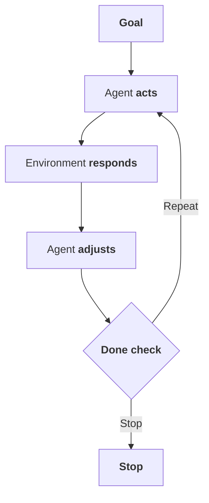
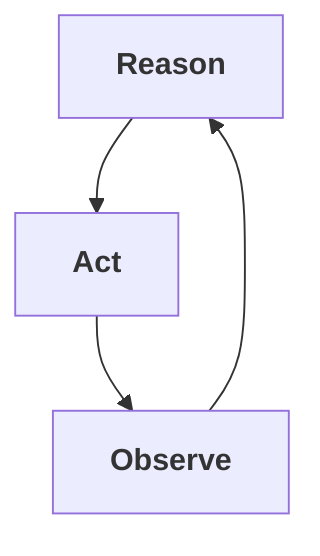
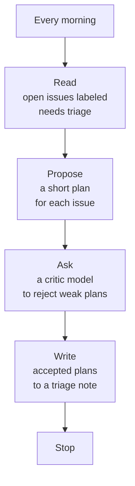

# Loop Engineering

Prompting asks once. Loop engineering designs the system that keeps working, checking, and stopping.

Prompting is what you do when you want one answer.

Loop engineering is what you do when you want a system to keep working until a condition is met.

That distinction sounds small until you use coding agents for real work. A prompt gives the model a task. A loop gives the model a task, tools, feedback, memory, stopping rules, and a way to try again.

In the simplest version:



## Why People Are Talking About Loops

The recent conversation around loop engineering is partly a naming catch-up.

Agents have always had loops somewhere inside them. A model calls a tool, sees the result, and decides what to do next. What changed is that people are now designing the loops directly instead of only writing better prompts.

Addy Osmani describes loop engineering as replacing yourself as the person who keeps prompting the agent. Instead of typing every next instruction, you design the system that finds work, hands it out, checks it, records state, and decides what comes next.

LangChain frames the stack as multiple loops:

- The basic agent loop
- A verification loop
- An event-driven loop
- A hill-climbing loop that improves the harness from traces

MindStudio explains the beginner version: a loop is a repeating cycle where the model acts, observes the result, and uses that feedback to decide the next move until a termination condition is met.

These are not competing definitions. They are different zoom levels.

## The Core Loop

At the center is the same shape as the ReAct agent pattern:



The agent reasons about the next step, acts through a tool, observes the result, and uses that observation to continue.

For coding agents, the loop often looks like:

```text
read files -> edit code -> run tests -> inspect failure -> revise -> run tests again
```

This is why loop engineering matters more for coding than for many one-shot tasks. Software already has feedback surfaces: tests, type checks, lint, screenshots, logs, benchmarks, and review comments. A useful agent can use those surfaces as observations.

Read the companion intro: [The ReAct Agent Pattern](./react-agent-pattern.md).

## What Makes A Loop Engineered

A loop is not engineered just because it repeats.

A good loop has a few explicit parts.

### A Goal

The loop needs to know what it is trying to accomplish.

Bad:

```text
Improve the app.
```

Better:

```text
Make the checkout flow pass the existing browser test and do not change the payment API.
```

### A Done Check

The loop needs a stopping condition.

Examples:

- Unit tests pass
- Generated report has all required sections
- Screenshot matches a rubric
- Human approves the plan
- Maximum attempts reached

Without a done check, a loop either stops arbitrarily or keeps spending.

### Tools

The agent needs a way to interact with the world.

For software work, tools are usually file reads, file edits, shell commands, search, test runners, browser control, and issue tracker access.

The tool set should be narrow enough to be safe and broad enough to let the agent verify its own work.

### Memory

Loops need memory outside the current model response.

That can be a state file, a task board, a trace store, a database row, or a versioned object. The key is that the loop should know what it already tried and what happened.

Without memory, a loop repeats mistakes.

### Verification

A loop should not trust the same generation step that produced the work.

Verification can be deterministic, like tests. It can be model-based, like a rubric grader. It can be human, especially for judgment-heavy or sensitive work.

The point is to make "done" mean something.

### Human Gates

Some actions need approval.

Examples:

- Deleting data
- Spending money
- Publishing externally
- Changing production settings
- Making irreversible edits

Automation does not remove the human. It changes where the human belongs.

## How Loop Engineering Relates To Model Relay

Loop engineering sits above the [Model Relay Pattern](./model-relay-pattern.md).

Loop engineering answers:

- When does the system run?
- What triggers it?
- What is the stopping condition?
- What happens when it fails?
- How does it improve over time?

Model Relay answers:

- Which role handles this phase?
- Which model should do that role?
- What artifact is passed to the next role?
- Who approves the handoff?
- What evidence is attached?

They compose naturally.

Example:

```text
Event-driven loop:
  When a new issue is labeled "ready"

Model Relay:
  Proposer -> Critic -> Reconciler -> Executor -> Verifier

Done check:
  Verified patch exists, tests pass, human approves PR
```

The loop keeps the workflow moving. The relay keeps the work separated into accountable roles.

## The Common Failure Modes

### No Exit

The agent keeps trying because nobody defined failure.

Fix:

```text
Stop after five attempts, repeated identical failures, or 20 minutes.
```

### Fake Progress

The agent keeps changing things, but the underlying result is not improving.

Fix:

Track attempts and compare observations. If the same error appears twice, require a strategy change.

### Context Bloat

Every iteration adds more logs, diffs, and commentary until the model loses the task.

Fix:

Keep full logs outside the prompt. Feed the model a compact state summary.

### Self-Grading

The agent that made the work declares it finished.

Fix:

Use a separate verifier, a deterministic check, or a human gate.

### Too Much Autonomy Too Early

The loop runs before the team understands how it behaves.

Fix:

Run it manually first. Then run it with approval gates. Then automate the boring parts.

## A Small Loop Worth Building

Do not start with a swarm.

Start with a boring loop:



No code execution. No autonomous merging. No production changes.

That loop is already useful because it removes repeated prompting and creates a durable work artifact.

Once that is reliable, add execution. Once execution is reliable, add verification. Once verification is reliable, add scheduling.

## Sources Worth Reading

- [Loop Engineering, Addy Osmani](https://addyosmani.com/blog/loop-engineering/)
- [The Art of Loop Engineering, LangChain](https://www.langchain.com/blog/the-art-of-loop-engineering)
- [What Is Loop Engineering?, MindStudio](https://www.mindstudio.ai/blog/what-is-loop-engineering-ai-coding-agents)
- [ReAct paper on arXiv](https://arxiv.org/abs/2210.03629)

The ReAct paper is the canonical source for the inner reason-act-observe loop. The loop engineering posts are practitioner sources for the newer outer-loop vocabulary: triggers, verification, traces, memory, schedules, and self-improving harnesses.

## The Useful Mental Model

Prompting is conversation.

ReAct is the inner loop of one agent using tools.

Model Relay is the handoff of one task through role-specific models.

Loop engineering is the outer system that decides when those workflows run, how they repeat, and when they stop.

Those layers should not be blurred. Separating them makes the system easier to build, audit, and improve.
