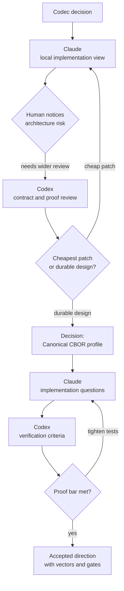

# Model Relay In Practice: Choosing Canonical CBOR

A relay is clearest when it changes the decision, not just the wording.

The Model Relay Pattern is easiest to understand when the decision has real architecture cost.

This example reconstructs an architecture decision from a content-addressed storage system. The details are intentionally generalized, but the pattern is real: one model was deep in the implementation, another model had the wider field, and the human moved the decision between them.

The question was whether the system should keep its existing bespoke canonical byte codec or move to deterministic CBOR while the design was still being shaped.

Claude was on the ground. It had the active implementation task, local code changes, and the immediate pressure to close the issue.

Codex had the wider repository view. It could read the architecture notes, current object codec, ABI notes, conformance vectors, agent guidance, and the already-started code. It could also challenge the premise that the cheapest patch was the right long-term design.

That is exactly where Model Relay helps.

## The Relay Shape



The value is not the model choice by itself. The value is that each role has a different job.

Claude proposes from inside the work. Codex critiques from outside the trench. The human keeps control of the handoff.

## Step 1: The Implementation Model Frames The Local Choice

Claude's local frame was reasonable:

```text
We already have a deterministic length-prefixed object codec in loom-core.
It drives object digests.
ABI result payloads still cross as interim JSON.
The shortest path is to extend the existing codec to IDL result types.
```

That is a good implementation-local observation. It sees the current system clearly.

The local recommendation looked like this:

- Codec: extend the existing bespoke length-prefixed codec.
- Reason: one deterministic codec already drives digests.
- Risk of CBOR: it creates a second canonical form or forces a digest repin.
- Async: defer. Keep sync now and make async additive later.

For a normal issue close, that might be enough.

But this was not only an issue close. It was an architecture decision being made while the design was still flexible.

## Step 2: The Human Spots A Decision Smell

The human noticed the pressure in the recommendation.

The project was still in a design phase. The implementation existed, but it was not yet the only thing that mattered. So the right question was not:

```text
What is cheapest to finish this task?
```

The right question was:

```text
While the design is still flexible, what should the long-term codec be?
```

That is the moment to relay.

The human brought Claude's local recommendation to Codex and asked for an independent review.

## Step 3: The Field Model Checks The Contract

Codex did not answer only from the pasted summary. It inspected the repo.

It checked:

- The binding contract, where complex payloads cross language boundaries
- The core interface, where async behavior affects every binding
- The wire protocol notes, where JSON and RPC formats are projections rather than identity
- The object model, where identity was already defined by canonical bytes plus a digest
- The digest layer, where the current hash choice was separable from the encoding choice
- The conformance tests, where existing vectors pinned current behavior
- The agent guidance, where minimal-diff defaults could bias agents toward short-term work

The key finding was that the implementation already leaned toward bespoke bytes, but the design was still movable.

That changed the answer.

## Step 4: The Critique Separates Patch Cost From V1 Design

Codex split the decision in two:

- Cheapest patch: extend the bespoke codec.
- Right design while in a design phase: adopt a strict Loom Canonical CBOR profile for identity and ABI payloads.

That distinction was the whole point.

Bespoke bytes were cheap because they already existed. CBOR was better because the system needed a durable, cross-language, readable canonical format. The right answer was allowed to challenge existing work because the design was still being formed.

Codex also rejected two common shortcuts:

- Protobuf is good for gRPC, but not for content-addressed identity because serialized bytes are not a stable cross-language canonical form.
- JSON is good for debug and admin surfaces, but not for compact deterministic identity.

The recommended decision became:

- Use Loom Canonical CBOR v1.
- Make it a strict profile of RFC 8949.
- Use it for object identity and ABI result payloads.
- Keep protobuf as the gRPC transport.
- Keep JSON as debug/admin output.
- Pin canonical bytes separately from digest vectors.

## Step 5: The Relay Improves The Agent Instructions

The review also found a process bug.

AGENTS.md told agents to follow existing patterns, keep minimal diffs, and avoid dependency changes unless the task demanded them. Those are good default engineering rules. But they can make an implementation model short-sighted during architecture decisions.

So the human asked Codex to edit AGENTS.md.

The new rule was an architecture decision mode:

- When asked for the right long-term, strategic, or standard-setting path, the current implementation is evidence, not precedent.
- Separate the cheapest patch from the intended product design.
- Prefer durable standards with strict profiles over bespoke formats unless the bespoke choice has a measured durable advantage.
- Treat design-phase contracts and conformance vectors as movable while decisions are still being formed.
- Demand canonical proof before calling identity-affecting formats settled.

That is Model Relay becoming executable process.

The workflow did not just produce an answer. It changed the instructions for future agents so they would be less likely to make the same short-term mistake.

## Step 6: The Implementation Model Asks Better Questions

Once the direction moved back to Claude, the questions got sharper.

Instead of asking "bespoke or CBOR," Claude asked implementation questions:

- Which CBOR library?
- Where should the codec live?
- What object shape should it use?
- How should async work at the ABI?
- How should hash vectors be split from canonical-byte vectors?
- What proof bar makes the codec settled?

That is what a good relay does. It turns a vague architecture disagreement into smaller decisions that can be accepted or rejected.

The reconciled answers were:

- Use an owned `loom-codec` crate, not a hidden helper inside `loom-core`.
- Use positional arrays for fixed-shape identity objects: `[epoch, type, ...fields]`.
- Use integer-key maps only for sparse or genuinely evolvable structures.
- Keep BLAKE3-256 for v1, but split canonical-byte vectors from digest vectors.
- Build the `LoomTask*` poll form as the ABI async primitive, with callbacks and Promise/Future wrappers layered above it.
- Require pinned vectors, negative decode tests, round-trip tests, and fuzzing before the codec is considered settled.

## Step 7: The Verifier Catches A Subtle Float Edge

Later, Claude found a real codec edge case.

SQL values include `Float`, `F32`, and `Point`. Those can hold NaN, positive infinity, negative infinity, and negative zero. But Loom Canonical CBOR rejects those CBOR float bit patterns. That rejection is correct for ordinary CBOR floats because otherwise the same logical value could have multiple byte forms.

The implementation-local proposal was:

```text
Do not encode SQL Float/F32/Point as CBOR floats.
Encode their raw IEEE-754 bits as canonical CBOR unsigned integers.

Float(f64) -> [3, Uint(f.to_bits())]
F32(f32) -> [15, Uint(f.to_bits())]
Point{x,y} -> [23, Uint(x.to_bits()), Uint(y.to_bits())]
```

Codex reviewed that against the current code.

The answer was mostly yes, with a correction:

- This is the right rule for the CBOR migration of SQL row values.
- But the latest code still stores tabular row values in bespoke binary.
- So phrase it as a migration rule, not as a description of current behavior.

The review also added proof requirements:

- Decode must range-check `F32` bit payloads to `u32`.
- Add vectors for `+0.0`, `-0.0`, `+Inf`, `-Inf`, quiet NaN, signaling NaN, and distinct NaN payloads.
- Keep the separate order-preserving prolly key codec untouched because CBOR does not preserve Loom's byte-lexicographic index ordering.

That is the Verifier role working. It did not just say "looks good." It checked the proposal against current code and tightened the acceptance criteria.

## Why This Was A Model Relay, Not A Chat

Each phase had a different job.

The implementation model saw the immediate shape: "We have a codec. Extend it."

The field model saw the architectural shape: "The design is still flexible. Do not let current code become accidental law."

The human saw the meta-problem: "The implementation agent is probably optimizing for task closure. I need a second role before approving the direction."

The result was better than any one response:

- A strategic codec decision
- A concrete implementation plan
- A stricter proof bar
- A process update in AGENTS.md
- A later correction for float edge cases

That is the pattern.

## The Handoff Packet

The useful artifact was not the transcript. It was the handoff packet.

A compact version would look like:

```text
Decision:
Adopt Loom Canonical CBOR v1 as the identity and ABI codec.

Rejected:
Do not keep bespoke bytes as the v1 identity format.
Do not use protobuf as canonical identity.
Do not keep JSON as the normative ABI payload format.

Implementation:
Create loom-codec.
Encode objects as [epoch, type, ...fields].
Use canonical-byte vectors plus digest vectors.
Build strict decode tests and fuzzing.
Keep order-preserving key codecs separate.

Special case:
SQL Float/F32/Point encode raw IEEE bits as CBOR Uint payloads, not CBOR Float.

Proof:
Pinned bytes, negative decode tests, round-trip tests, no-panic fuzz target, cross-language vectors with first non-Rust binding.
```

That packet can move between models, tools, PR descriptions, or issue comments. It survives better than a chat summary because it names the decisions and the evidence.

## What The Pattern Teaches

A model close to implementation is valuable because it knows the ground truth of the active work.

A model with wider context is valuable because it can challenge accidental commitments.

The human is valuable because they can notice when the mode changed from "finish the task" to "set the architecture."

Model Relay makes those differences explicit. It is not more process for its own sake. It is a way to stop one model response from doing five jobs badly.

The best relay runs are not long. They are structured:

- Propose locally.
- Critique globally.
- Reconcile explicitly.
- Execute narrowly.
- Verify against proof.

That is how a codec decision became more than "CBOR or bespoke." It became an architecture decision with a migration plan and a testable proof bar.

## Related Pattern

Read the general pattern: [The Model Relay Pattern](./model-relay-pattern.md).
