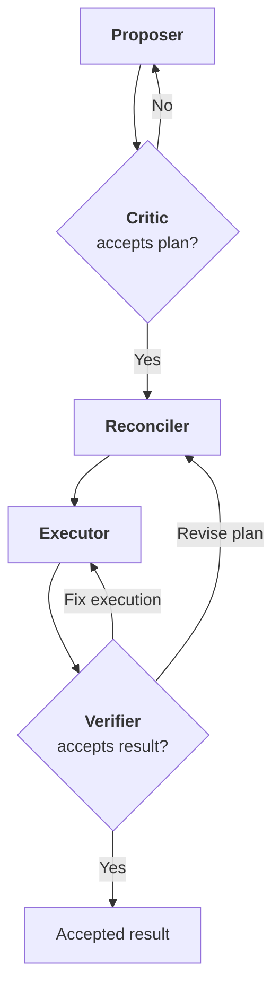
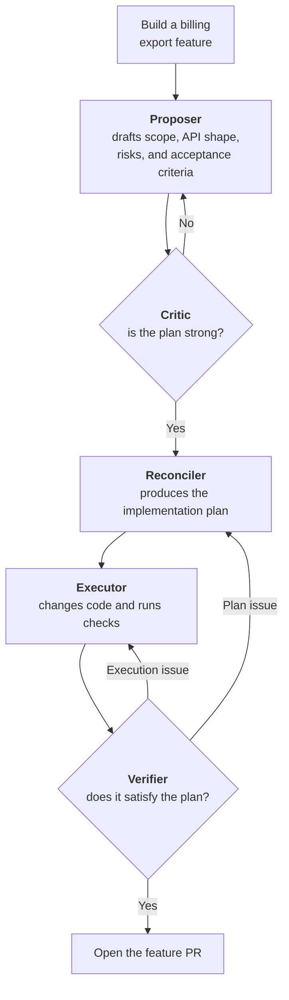

# The Model Relay Pattern

Model Relay is what you use when one blended model answer is too much responsibility for one role.

You ask Claude to make a task list. Then you ask Codex to review it. Codex finds gaps, asks for sharper acceptance criteria, and suggests a better order. Then you paste that back into Claude. Sometimes a third system executes the plan. Sometimes another model reviews the result.

The manual copy-and-paste is implementation friction. The useful part is the role structure.

The workflow is not really "one AI assistant." It is one piece of work moving through several roles. Each role can be handled by the same model, a different model, a human, or a tool-backed agent. The important part is the handoff.

That shape is the Model Relay Pattern.



## The Short Version

Model Relay is a collaborative AI workflow where a task moves through role-specific phases before the result is accepted.

One model may propose. Another may critique. Another may reconcile the plan. Another may execute. Another may verify. A small task may use only one or two phases. A risky task may use all five.

The pattern is not "use more agents." It is "separate the jobs that should not be collapsed into one model response."

For a concrete walkthrough of the pattern applied to a real architecture decision, read [Model Relay In Practice: Choosing Canonical CBOR](./model-relay-cbor-example.md).

## The Five Roles

### 1. Proposer

The Proposer turns intent into a plan.

Its output should not be code first. It should be a work artifact:

- Goal
- Assumptions
- Task list
- Acceptance criteria
- Test or verification plan
- Known risks
- Questions that need a human answer

The Proposer is useful when the user has an idea but the work is still soft around the edges.

### 2. Critic

The Critic reviews the proposal before execution.

This is the first important split. The model that generated a plan is usually too committed to it. A Critic should be instructed to look for ambiguity, missing tests, bad sequencing, hidden dependencies, unsafe assumptions, and cases where the plan is bigger than the prompt actually justified.

The Critic does not execute. Its job is to improve the plan.

### 3. Reconciler

The Reconciler turns proposal plus critique into a revised plan.

This role matters because criticism is not the same thing as a decision. A good critique can contain five suggestions, only three of which should be accepted. The Reconciler creates the actual handoff packet:

- Accepted changes
- Rejected changes, with reasons
- Revised task order
- Final acceptance criteria
- Open questions

Without this step, the workflow often becomes a pile of comments that the next model has to interpret from scratch.

### 4. Executor

The Executor does the work.

In coding systems, this may mean editing files, running tests, opening a pull request, or producing a patch. In non-coding workflows, it may mean writing the document, filling a spreadsheet, creating a report, or calling external tools.

The Executor should work from the reconciled plan, not from the original prompt. That is the main discipline of the relay.

### 5. Verifier

The Verifier checks the result against the approved plan.

This is different from a generic review. The Verifier should not ask, "does this look good?" It should ask:

- Did the Executor do what the reconciled plan said?
- Are the acceptance criteria satisfied?
- Were the agreed checks actually run?
- Did the work introduce new risk?
- Is there evidence, such as logs, tests, screenshots, or diffs?

The Verifier may be deterministic, such as a test runner. It may be a model with a rubric. It may be a human. For important work, it is often more than one of these.

## Why This Is Not Just Multi-Agent

Multi-agent is an implementation strategy. Model Relay is a workflow pattern.

You can implement Model Relay with five autonomous agents talking to each other. You can also implement it with one desktop app, three model providers, a local worktree, and a human clicking approve between phases.

The pattern is about role separation and handoff state. The agents are optional.

That distinction matters because many useful workflows are not fully autonomous. A developer may want to choose Claude for proposal, Codex for critique, a local model for cheap summarization, and a high-capability model for verification. The human remains the orchestrator. The desktop app keeps the state.

## Pattern Composition

Model Relay describes how one unit of work moves through accountable roles. It does not require every surrounding workflow to be part of the pattern.

Other agent patterns can sit below or above it.

A lower-level pattern can describe how a single role does its work. An outer-loop pattern can describe when relay runs start, repeat, stop, and escalate. That distinction keeps Model Relay narrow: it is the handoff model, not the whole automation stack.

## Example Below: ReAct Inside A Relay Phase

ReAct can sit inside one phase of the relay.

The original ReAct work combined reasoning and acting in an interleaved trajectory: reason about the next step, take an action, observe the result, and continue. That is a good shape for an Executor. It can also be useful for a Critic that needs to inspect files or a Verifier that needs to gather evidence.

But ReAct does not decide which model should propose, which model should critique, or how the handoff artifact should be versioned. Those are Model Relay concerns.

Read the companion intro: [The ReAct Agent Pattern](./react-agent-pattern.md).

## Example Above: Loop Engineering Around A Relay

Loop engineering can sit around the relay.

A loop decides when work is selected, how often the workflow runs, what counts as done, and when a human should be alerted. The relay decides how each selected unit of work moves through roles.

For example:



The outer loop chooses and repeats the work. Model Relay makes the feature path accountable: proposal, critique, reconciliation, execution, verification, and revision are separate handoff states instead of one blended model response.

Read the companion intro: [Loop Engineering](./loop-engineering.md).

## Should Versioning Be Part Of The Pattern?

The base pattern should be generic.

Model Relay should not require a content-addressed filesystem, a version-control backend, or any specific product. If the pattern is useful, it should be explainable with a whiteboard, a folder of Markdown files, or a spreadsheet.

But versioning is not incidental. It is what makes the pattern safer and easier to trust once the workflow becomes more than a whiteboard.

Model Relay explains the role handoff. [Versioned Decisioning](/blog/versioned-decisioning-pattern/) explains how those handoffs become durable decision state.

## Failure Modes

The pattern can fail in boring ways.

Too many phases for small work. If the task is trivial, a relay is ceremony.

Weak handoff artifacts. If each phase returns prose with no structure, the next phase has to guess.

Verifier theater. A second model saying "looks good" is not verification. Verification needs criteria and evidence.

No human gates. Some tasks need approval before execution, not after.

Model monoculture. Running the same model five times with similar instructions may add cost without adding perspective.

## A Practical Starting Point

Start with three phases:

```text
Proposer -> Critic -> Reconciler
```

Use that for planning before execution. It removes the manual copy and paste loop while keeping the human in control.

Then add Executor when the plan is concrete enough to run.

Then add Verifier when the output has real cost if it is wrong.

That is the practical version of the pattern: a clean relay of responsibility from one role to the next.

## Teach Your Agent Harness Model Relay

The pattern is meant to be executable.

Use these AGENTS.md files to teach an agent harness how to run Model Relay with subagents, model profiles, or human gates:

- [Model Relay AGENTS.md](/blog/model-relay-pattern/AGENTS.md)
- [Proposer AGENTS.md](/blog/model-relay-pattern/proposer/AGENTS.md)
- [Critic AGENTS.md](/blog/model-relay-pattern/critic/AGENTS.md)
- [Reconciler AGENTS.md](/blog/model-relay-pattern/reconciler/AGENTS.md)
- [Executor AGENTS.md](/blog/model-relay-pattern/executor/AGENTS.md)
- [Verifier AGENTS.md](/blog/model-relay-pattern/verifier/AGENTS.md)

Hermes and OpenClaw can map these roles to different subagents or LLM providers. Claude and Codex can map them to different model settings, tools, or thinking budgets. The important part is that each role has a separate instruction surface and a durable handoff packet.

## Sources

- [ReAct: Synergizing Reasoning and Acting in Language Models](https://arxiv.org/abs/2210.03629)
- [ReAct project page](https://react-lm.github.io/)
- [Google Research ReAct blog](https://research.google/blog/react-synergizing-reasoning-and-acting-in-language-models/)
- [Loop Engineering, Addy Osmani](https://addyosmani.com/blog/loop-engineering/)
- [The Art of Loop Engineering, LangChain](https://www.langchain.com/blog/the-art-of-loop-engineering)
- [What Is Loop Engineering?, MindStudio](https://www.mindstudio.ai/blog/what-is-loop-engineering-ai-coding-agents)
