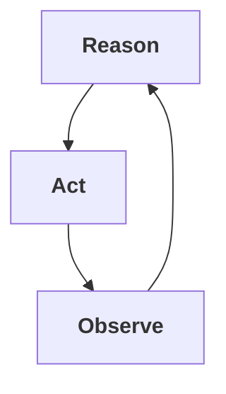

# The ReAct Agent Pattern

ReAct is the inner loop that lets a model use evidence instead of only prediction.

The simplest useful agent loop is explicit.

The model thinks about what to do next. It takes an action. It observes what happened. Then it repeats.

That is the practical reading of ReAct:



The original paper, [ReAct: Synergizing Reasoning and Acting in Language Models](https://arxiv.org/abs/2210.03629), introduced the pattern as a way to interleave reasoning traces with task-specific actions. The project page describes the core question plainly: what happens if reasoning and acting are combined instead of treated as separate capabilities?

## What ReAct Is Trying To Fix

Before ReAct, two common shapes were easy to find.

One shape was reasoning without tools. The model would produce a chain of reasoning and answer from its internal knowledge. That can work, but it is not grounded in the environment. If the model needs fresh information, a file, an API result, or a test output, internal reasoning is not enough.

The other shape was acting without enough reasoning. The model could call tools or choose actions, but it might not maintain a useful plan, recover from mistakes, or explain why the next action made sense.

ReAct joins those together.

The model can reason in language, take an action, receive an observation from the environment, and use that observation to update the next step.

## The Basic Loop

A ReAct-style agent usually has three visible beats.

### Reason

The agent decides what it knows, what it needs, and what it should try next.

In a coding task, that might mean:

- Identify which test is failing
- Decide which file is likely relevant
- Notice that the last error changed
- Adjust the plan after a failed command

### Act

The agent does something through a tool.

Examples:

- Search a codebase
- Read a file
- Edit a file
- Run a test
- Query a database
- Search documentation

### Observe

The environment returns evidence.

Examples:

- Test output
- Compiler errors
- Search results
- File contents
- HTTP response
- Screenshot

The observation is what makes the loop more than a monologue. The model is no longer just predicting a plausible answer. It is reacting to what happened.

## Why The Observation Matters

The Observe step is the part beginners often underweight.

Without observation, a model can sound finished without being finished. With observation, the agent can be forced to confront the result of its action.

In software, this is the difference between:

```text
I changed the code and it should work.
```

and:

```text
I changed the code, ran the test, saw this failure, adjusted the fix, and ran it again.
```

That second shape is why ReAct became foundational for coding agents.

## ReAct Is Not A Whole Product Architecture

ReAct is a pattern for a single agent's behavior inside a task. It does not answer every system design question.

It does not decide:

- Which model should handle which role
- When a human should approve a step
- How to persist the task state
- How to compare two agents' proposals
- How to verify that a final output satisfies a plan

Those questions live at higher layers.

In the [Model Relay Pattern](./model-relay-pattern.md), ReAct can sit inside any phase. The Executor might use ReAct to edit files and run tests. The Critic might use ReAct to inspect a repository. The Verifier might use ReAct to gather evidence.

But Model Relay is about passing work through roles. ReAct is about how one role can reason, act, and observe.

## A Small Example

Prompt:

```text
Fix the failing test. You may read files and run the test command. Stop after five attempts if it still fails.
```

A ReAct-style trajectory might look like:

```text
Reason: I need to see which test fails.
Act: run tests
Observe: one assertion fails in parser_test.

Reason: The failure points to whitespace handling. I should inspect the parser.
Act: read parser source
Observe: trim is applied before tokenization.

Reason: The test expects trailing whitespace to be preserved in one mode. I should inspect the mode flag.
Act: edit parser
Observe: file changed.

Reason: I need to verify.
Act: run parser tests
Observe: parser tests pass.
```

The important part is not the labels. The important part is that action changes the environment, observation reports back, and the next step is based on evidence.

## Failure Modes

ReAct can still fail.

It can loop on the same bad idea. It can call tools without reading the output carefully. It can produce a plausible explanation for a command it did not actually run. It can overfit to a visible test while missing the real requirement.

That is why ReAct needs guardrails:

- A clear goal
- Tool permissions
- A maximum number of turns
- A real stopping condition
- Logs of actions and observations
- Verification outside the agent when stakes are high

## Canonical Sources

Start with the original sources:

- [ReAct paper on arXiv](https://arxiv.org/abs/2210.03629)
- [ReAct project page](https://react-lm.github.io/)
- [Google Research blog post](https://research.google/blog/react-synergizing-reasoning-and-acting-in-language-models/)

The paper frames ReAct as an interleaving of reasoning traces and actions. The Google Research post gives a readable overview and examples. The project page links the paper, code, and examples.

## The Useful Mental Model

ReAct is the inner loop.

It is what lets a single model operate against a real environment instead of answering from prior context alone.

When people say an agent "uses tools," ReAct is often the shape underneath. When people say an agent "keeps working until the tests pass," ReAct is one of the mechanisms that makes that possible.

But ReAct is not the whole stack. It is the small loop inside larger patterns like Model Relay and loop engineering.
