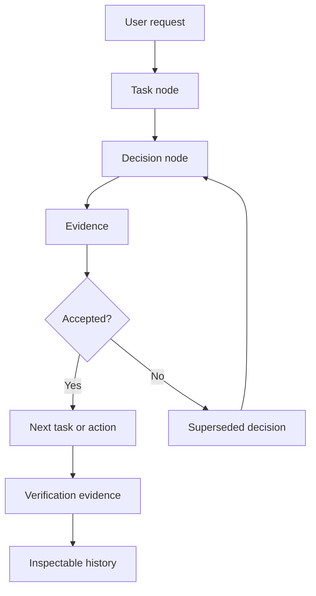
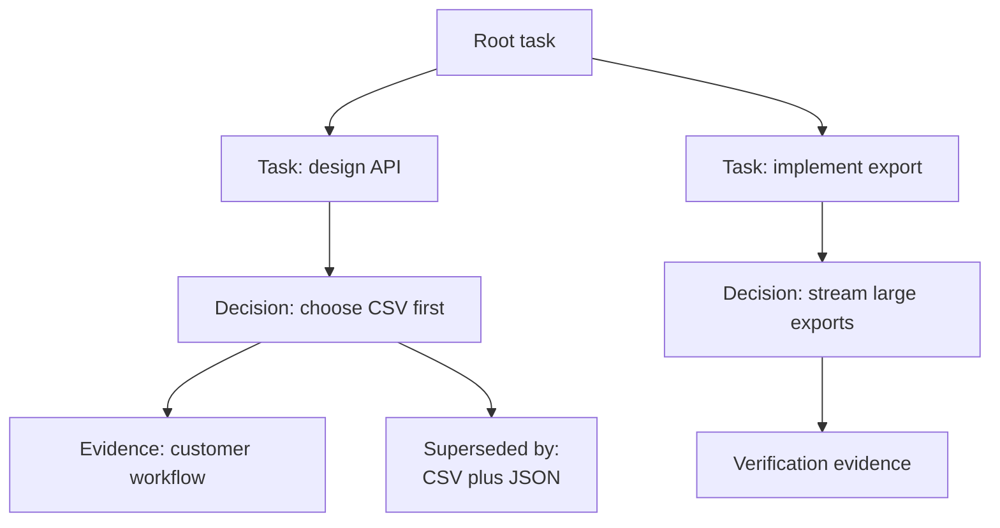

# The Versioned Decisioning Pattern

Versioned Decisioning turns AI decisions from chat residue into state you can inspect, supersede, and reverse.

Most agent workflows treat decision state as chat residue.

The model proposes a plan. The user approves part of it. The model changes course after an error. Another model critiques the result. A human says to undo one choice but keep another. By the end, the important state is scattered across transcript fragments, tool logs, and memory.

Versioned Decisioning is the pattern of turning meaningful model decisions into durable state.



## The Short Version

Versioned Decisioning makes the agent's task and decision history inspectable, traceable, and reversible.

It records not only what the agent did, but why it did it, what evidence it used, what alternatives it rejected, and which later decision superseded an earlier one.

The pattern is not "save the chat." It is "make decision state a first-class artifact."

## What Gets Versioned

A useful decision record includes:

- User request
- Active task
- Decision being made
- Options considered
- Chosen path
- Rejected paths
- Evidence used
- Tool outputs
- Human approvals
- Verification results
- Superseded decisions

That state should be structured enough for a later role, model, or human to inspect it without reconstructing the whole conversation.

## Why Versioning Changes The Model Process

Versioning is not just storage.

Once decisions are versioned, the model can work differently.

It can ask:

- What task am I actually working on?
- Which decision created this task?
- What evidence supported that decision?
- Has a later decision superseded it?
- Did the user approve this branch?
- Can I revert only this task without undoing unrelated work?

That gives the agent a memory that is more precise than a summary and more operational than a transcript.

## Loom As The State Layer

Loom gives agents a durable state layer for this pattern.

The Loom MCP exposes task tracking operations, then extends them with versioned decision state. The agent does not keep the important state in the chat transcript. It records the active task, the decision being made, the evidence behind it, and the accepted or superseded result in Loom.

The agent can:

- Create and update tasks
- Mark tasks blocked or complete
- Create decision nodes
- Attach evidence
- Link decisions to tasks
- Inspect the task tree
- Inspect the decision tree
- Supersede a decision
- Revert a task
- Revert a decision

The important extension is the tree.



A task can have child tasks. A decision can create or change tasks. A decision can supersede another decision. Evidence can attach to a task, a decision, or a verification result.

That turns an agent run into inspectable state. A later model can ask Loom for the active task, read the decision that created it, inspect the evidence, and see which alternatives were rejected. A human can ask why a branch exists without rereading the whole conversation.

## Reverting A Decision

The most practical benefit is targeted reversal.

Without versioned decisions, "undo that" is ambiguous. The agent may not know whether the user means the last file edit, the plan choice that caused it, the task branch, or the whole workflow.

With Loom, the user can say:

```text
Revert the decision where we chose CSV only.
```

The agent asks Loom to inspect the decision tree, finds the decision node, identifies the accepted state before that decision, and explains the revert.

The revert itself becomes a new decision node. Nothing disappears. The history records that the old branch was superseded.

## AGENTS.md

The pattern is mounted into an agent harness through AGENTS.md files:

- [Versioned Decisioning AGENTS.md](/blog/versioned-decisioning-pattern/AGENTS.md)
- [Loom Versioned Decisioning AGENTS.md](/blog/versioned-decisioning-pattern/loom/AGENTS.md)

The generic file teaches the pattern. The Loom file tells the agent to use Loom as its decision and task tracking tool.

When mounted, the agent treats Loom as the source of truth for active tasks, decisions, evidence, supersession, and targeted revert.

## Where It Fits

Versioned Decisioning composes with [Model Relay](/blog/model-relay-pattern/).

Model Relay separates responsibility across roles. Versioned Decisioning records the handoff state between those roles.

Together, they answer different questions:

- Model Relay: who should handle this phase?
- Versioned Decisioning: what decision state did they create, inspect, replace, or accept?

That is the durable version of agent collaboration.
